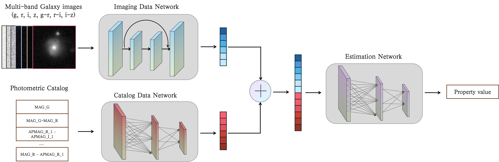

# A Value-Added Physical Properties Catalog for Low-redshift Galaxies from DESI Legacy Imaging Surveys DR10

[](https://doi.org/10.12149/101777)

## Overview
This repository provides the official implementation for a multimodal deep learning framework to estimate galaxy physical properties — including star formation rate (SFR), stellar mass (LGM), and gas-phase metallicity (OH) — using imaging and photometric data from DESI Legacy Imaging Surveys DR10.

The model integrates:
- A **ResNet-based CNN** for multi-band image feature extraction
- An **MLP encoder** for catalog-based photometric features
- A **fusion module** to combine multimodal representations


Paper: *(Accepted by ApJS. To be updated)*

> **Abstract**  
> Galaxy physical properties—such as star formation rate (SFR), stellar mass, and gas-phase metallicity—are essential for population studies and galaxy evolution analyses. Deriving these quantities for billions of galaxies in modern imaging surveys remains challenging due to limited spectroscopic coverage and the high computational cost of traditional SED fitting.  This work introduces a multimodal deep learning model that combines optical imaging and photometric catalog features to estimate SFR, stellar mass, and oxygen abundance for low-redshift galaxies. The model leverages complementary information from morphology, surface brightness, and broadband colors.  Trained on MPA-JHU DR8 measurements, the model enables efficient large-scale inference. Applied to DESI LS DR10, it produces a value-added catalog of ~547 million galaxies ($z \leq 0.5$). While not intended for precision measurements of individual objects, the model successfully recovers key astrophysical trends, making it suitable for large-scale statistical studies.
---

## Key Features
- Multimodal learning (image + catalog)
- Config-driven training pipeline
- Supports multiple targets (SFR, LGM, OH)
- Reproducible experiments (seed + config logging)
- Outputs intermediate representations for analysis

---

## Project Structure
```
multimodal-desilsdr10-properties-vac
├── assets/
│ └── Model.png
├── config/
│ └── config.yaml # experiment configuration
├── data/
│ ├── dataset.py # dataset & dataloader construction
│ ├── load_utils.py # data loading utilities
│ └── testset/ # toy dataset (for code validation)
│ ├── SFR/
│ ├── LGM/
│ └── OH/
├── models/
│ ├── estimator/FCN.py # prediction head
│ ├── fusion/concat.py # feature fusion
│ ├── MLP/MLP.py # catalog encoder
│ ├── ResNet/ResNet.py # image encoder
│ └── model.py # model wrapper
├── metrics.py # evaluation metrics & plots
├── train.py # training & evaluation pipeline
├── utils.py # utility functions
├── output/ # experiment outputs
├── weights/ # saved model weights
├── requirements.txt # Python dependencies for running the project
└── README.md
```


---

## Dataset (Toy Example)

We provide a **small toy dataset** for testing the pipeline.

- Built from cross-matching:
  - DESI LS DR10 imaging + photometry
  - MPA-JHU DR8 physical property catalog  
    (https://www.sdss4.org/dr17/spectro/galaxy_mpajhu/)

Each property contains **64 samples**.

### Data Format
- Images: `64 × 64 × 7`
  - bands: g, r, i, z, g−r, r−i, i−z
- Labels:
  - SFR → `SFR_TOT_P50`
  - LGM → `LGM_TOT_P50`
  - OH → `OH_P50`
- Catalog features:
  - SFR: 28 features
  - LGM: 50 features
  - OH: 1626 features (stored via `.txt` list)

---

## Configuration

All experiment settings are controlled via: `config/config.yaml`


### Important Notes
- All paths are **relative to the project root directory**
- Model hyperparameters are automatically selected based on:
  ```yaml
  Property_NAME: SFR | LGM | OH
    ```

---

## Quick Start
### Installation

```bash
git clone <repo_url>
cd multimodal-desilsdr10-properties-vac

conda create -n lsvac python=3.10
conda activate lsvac

pip install -r requirements.txt
```

### Train & Evaluate
```
python3 train.py 
```

### Only Evaluation
Modify:
```python
if __name__ == '__main__':
    main(only_test=True)
```


### Outputs
After training, results are saved under: `output/{Run_name}/`
#### Files
- `log_result_{property}.txt`
→ evaluation metrics (MSE, RMSE, NMAD, etc.)
- scatter_{property}.png
→ prediction vs. ground truth + residual plot
- {Run_name}_res.npz
→ contains:
    - x_true : ground truth
    - x_pred : predictions
    - indices: sample indices
    - representation: learned embeddings (penultimate layer)
- config.yaml
→ exact config used for this run

### Model Weights
Saved automatically during training (best validation model) in `weights/{Run_name}.pth`

---

## Reproducibility
- Fixed random seed (seed_everything)
- Config snapshot saved per run

---

## Citation

If you use this work, please cite:

@article{xxx2026,
  title={...}
}

---
## Other Resources

- **Full Value-Added Catalog (DESI LS DR10)**  
  The complete catalog released in this work is publicly available at:  
  https://doi.org/10.12149/101777 
  DOI: 10.12149/101777  

- **Dataset Citation**
```bibtex
@misc{wei2026desi_vac,
  author    = {Shirui Wei},
  title     = {A Value-Added Physical Properties Catalog for Low-redshift Galaxies from DESI Legacy Imaging Surveys DR10},
  year      = {2026},
  version   = {1.0},
  publisher = {National Astronomical Data Center of China},
  doi       = {10.12149/101777},
  url       = {https://doi.org/10.12149/101777}
}
```

---

## ToDo
- [ ] Add paper link (arXiv)
- [ ] Release pretrained model weights and usage interface
- [ ] Provide inference pipeline for large-scale prediction (Wei et al. 2026, in preparation)

